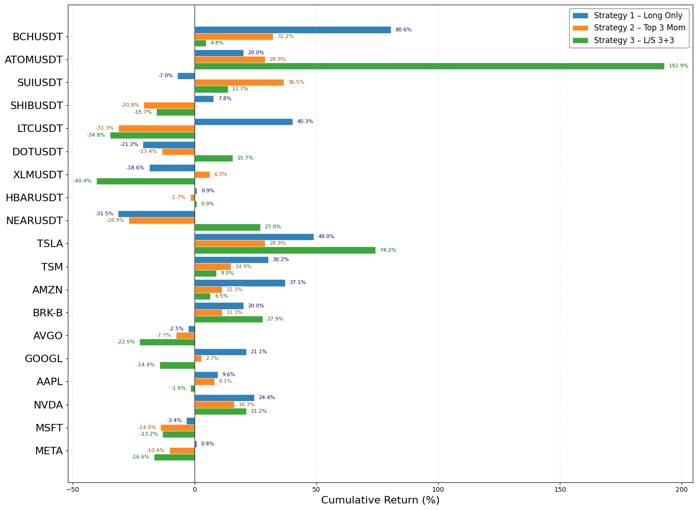

# ChanFormer


ChanFormer is a channel-wise Transformer architecture for multi-asset financial time-series forecasting. It is meticulously designed to study cross-asset interaction and representation learning without temporal patching, serving as a controlled architectural baseline against patch-based models.

------------------------------------------------------------------------

## Key Features

-   Multi-asset modeling (crypto, equities, or blended)
-   One-step-ahead OHLCV forecasting
-   Channel-wise Transformer encoder
-   Reversible Instance Normalization (RevIN)
-   Cross-channel mixer for asset interaction
-   Three experimental scenarios (crypto / stock / blended)

------------------------------------------------------------------------

## Project Structure

```text
ChanFormer
├── README.md
├── LICENSE.txt
├── dataset/
│   ├── crypto/
│   │   └── SUIUSDT_1d_full.csv
│   └── stock/
│       └── AAPL_1d_full.csv
└── src/
    ├── ablation.py
    ├── backtesting.py
    ├── ChanFormer.py
    ├── emissions.csv
    ├── overhead.py
    ├── PatchTST.py
    └── Transformer_benchmark.py
```

All training, evaluation, and forecasting logic is contained in
`ChanFormer.py`.

------------------------------------------------------------------------

## Core Idea

Instead of splitting time into patches, ChanFormer:

1.  Takes a 90-day historical window
2.  Flattens time per feature channel
3.  Projects into embedding space
4.  Applies Transformer encoding
5.  Mixes channels via MLP
6.  Predicts next-day OHLCV

Each feature channel becomes **one token**, removing temporal
cross-attention and isolating the impact of channel interaction.

------------------------------------------------------------------------

## Supported Assets

| #  | Cryptocurrency    | Stock |
| -- | --------- | ----- |
| 1  | ATOMUSDT  | AAPL  |
| 2  | BCHUSDT   | AMZN  |
| 3  | DOTUSDT   | AVGO  |
| 4  | HBARUSDT  | BRK-B |
| 5  | LTCUSDT   | GOOGL |
| 6  | MATICUSDT | META  |
| 7  | NEARUSDT  | MSFT  |
| 8  | SHIBUSDT  | NVDA  |
| 9  | SUIUSDT   | TSLA  |
| 10 | XLMUSDT   | TSM   |

------------------------------------------------------------------------

## Model Configuration

-   Sequence length: 90 days
-   Embedding dimension: 384
-   Attention heads: 6
-   Encoder layers: 4
-   Dropout: 0.10
-   Optimizer: AdamW
-   Learning rate: 8e-5
-   Weight decay: 5e-6
-   Batch size: 512
-   Max epochs: 6000
-   Early stopping patience: 700

------------------------------------------------------------------------

## Data Pipeline

-   Timestamp alignment across assets
-   Forward/backward fill missing values
-   Last 365 days reserved for testing
-   20% of pre-test data for validation
-   MinMax scaling per feature (fit on training only)
-   Gaussian noise injection during training

------------------------------------------------------------------------

## Evaluation Metrics

Computed on scaled space:

-   Global MSE
-   Global RMSE
-   Global MAE
-   Per-asset MSE / RMSE / MAE

Predictions are inverse-transformed before saving. Results are as follows:




------------------------------------------------------------------------

## Output Files

For each scenario:

-   `{scenario}_forecasts_no_patch_full_ohlcv2.csv`
-   `{scenario}_no_patch_global_result2.csv`
-   `{scenario}_no_patch_per_asset_results.csv2`
-   `{scenario}_model_no_patch_best.pth`

------------------------------------------------------------------------

## Installation

Recommended: Python 3.10+

    pip install torch pandas numpy scikit-learn

------------------------------------------------------------------------

## Usage

    python ChanFormer.py

The script automatically:

-   Trains all three scenarios
-   Saves best model per scenario
-   Exports forecasts and metrics
-   Prints final performance

------------------------------------------------------------------------

## Citation

``` bibtex
@misc{chanformer2026,
  author = {Nguyen Quoc Anh},
  title  = {ChanFormer: Channel-wise Transformer for Multi-Asset Financial Forecasting},
  year   = {2026},
  url    = {https://github.com/TheQuantScientist/ChanFormer}
}
```
